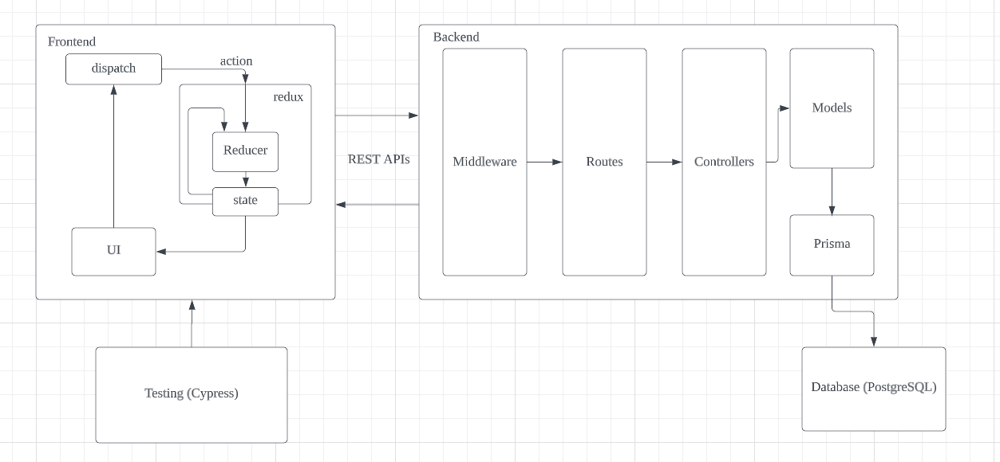
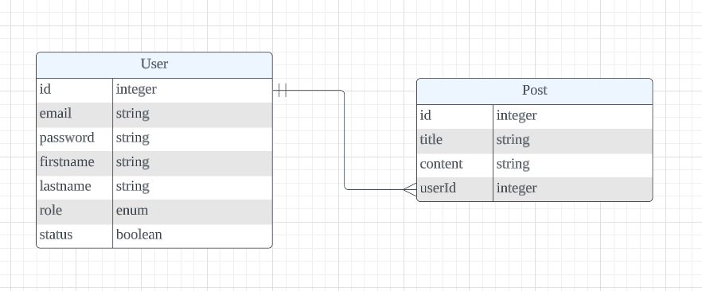
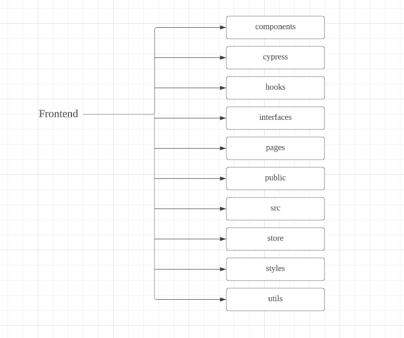
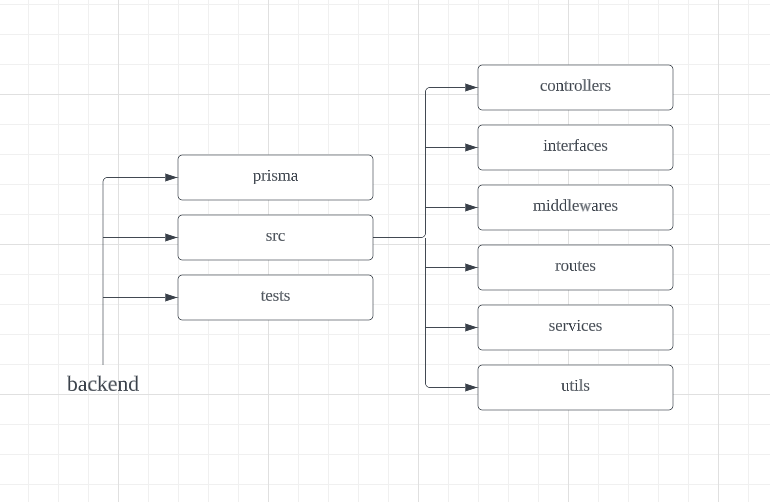
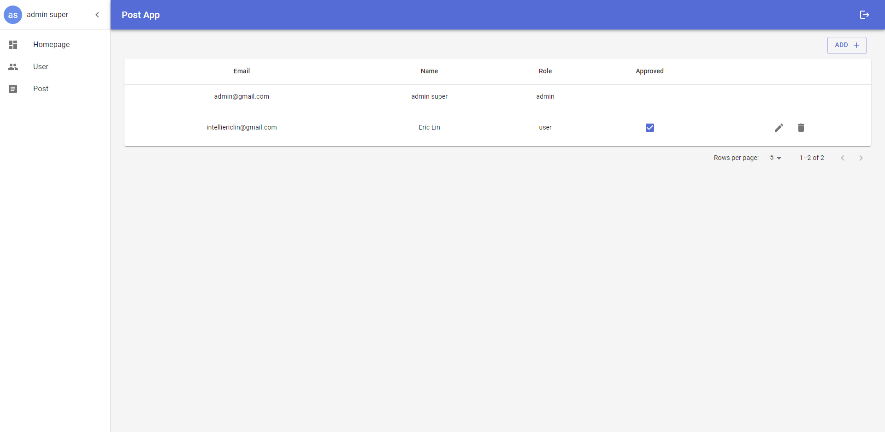

# Post Application

## Features

<code>+</code> Authentication & Authorization 

The application will have two user roles: "User" and "Admin". The Admin role can be created either through database seed or by another Admin user. Users can sign up for the application, but their credentials must be approved by an Admin before they can sign in.

<code>+</code> CRUD posts 

Users will be able to create, read, update, and delete their own posts. They will not be able to manage posts created by other users. Admins will have the ability to manage all posts, including creating, reading, updating, and deleting them.

<code>+</code> Admin can CRUD users 

Admins will have the ability to manage all users, including approving or disapproving new users. Users will not have the ability to manage other users.

## Architecture

  

## Database Schema

  

## Security

We employed JSON Web Token (JWT) for authentication, providing a token-based, stateless mechanism for user verification. Upon successful sign-in, the server generates a token and sends it to the client. The client then includes this token in the header of each subsequent request, allowing the server to verify the user's identity. Middleware on the server-side checks the token before passing the request to the corresponding controller. To sign out, the client simply deletes the stored token.

We implemented role-based authorization by defining two roles: admin and user. To differentiate between the two, we created admin middleware that verifies the requester's role. On the client side, user role restrictions prevent unauthorized access to the "Users" section in the application's sidebar. Furthermore, we introduced a "poster-or-admin" middleware that ensures only the original poster or an admin can modify a post.

To securely store passwords in the database, we utilized the bcrypt module, which hashes passwords and protects against brute-force attacks and other threats.

We implemented thorough data validation on both the frontend and backend of our application. On the frontend, we used Formik for form validation, while on the backend, we employed express-validator to check incoming data.

For enhanced security, we recommend implementing data encryption, logging and monitoring, and regular backups. These measures will further protect the application and its data.

## Deployment

Although the current application has not been deployed to a cloud platform, we have extensive experience with various tools and services, such as Amazon Web Services (AWS), Google Cloud Platform (GCP), Netlify, Heroku, and Vercel. These platforms provide scalable and reliable hosting solutions for deploying web

## Monitoring

The technologies that I used here are as follows.

- Frontend
  - Next.js
  - TypeScript
  - Redux Toolkit
  - Material UI
  - Cypress testing
- Backend
  - Express
  - Prisma
  - Jest
- Database
  - PostgreSQL
- Docker

<b>Frontend File Structure</b>

  

<b>Backend File Structure</b>

  

<b>Application View</b>

  

## Other technical aspects

I used docker to package an application and all of its dependencies into a single, portable container.

## Changelog

- v 1.0
  - The first version of the program
